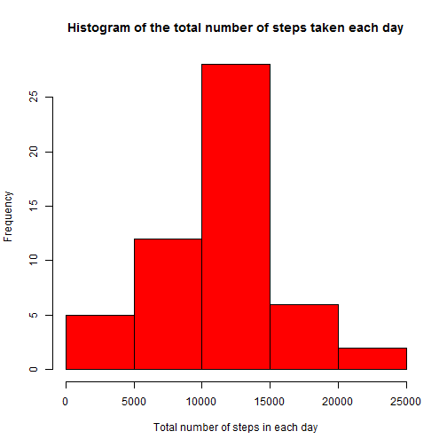
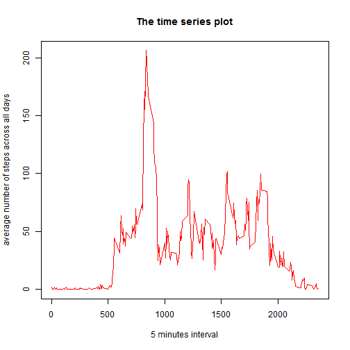
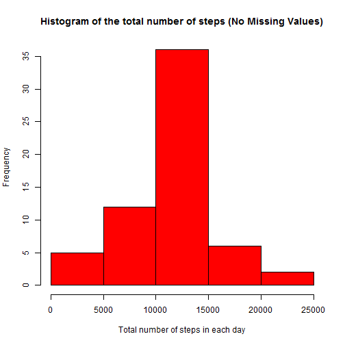
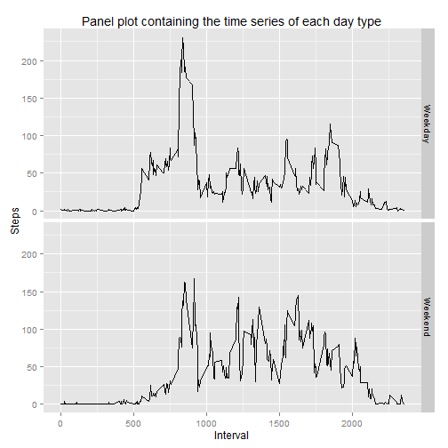

First Assignment
================

##Loading and preprocessing the data


```r
data<-read.csv("activity.csv")
```

Changing the date from "Factor" to "Date".


```r
data$date<-as.Date(data$date,format = "%Y-%m-%d")
```

##What is mean total number of steps taken per day?

In this part the missing values will be ignored.

### Calculating the number of steps taken per day

The data is splited into groups based on the dates and then in each group the count of the steps will be calculated. After that a Histogram is constructed.


```r
tmp <- data.frame(date=as.Date(character()),steps_count = numeric())
data2<-data[!is.na(data$steps),]
groups<-split(data2,data2$date)
for(i in groups)
{
        tmp <-rbind(tmp,data.frame(date = unique(i$date), steps_count = sum(i$steps)))
}
hist(tmp$steps_count,col = "red",main = "Histogram of the total number of steps taken each day", xlab = "Total number of steps in each day")
```

 

###The mean and median of the total number of steps taken per day


```r
m1<-mean(tmp$steps_count)
m2<-median(tmp$steps_count)
```

The mean of the total number of steps is 1.0766189 &times; 10<sup>4</sup> and the median is 10765.

##What is the average daily activity pattern?

###creating a time series plot of the 5-minute interval and the average number of steps taken, averaged across all days.

The data is splited into groups based on the 5-minutes intervals and then in each group the average of the steps will be calculated. After that a "time series plot" is constructed.


```r
tmp <- data.frame(interval=numeric(),avg_steps = numeric())
groups<-split(data2,data2$interval)
for(i in groups)
{
        tmp <-rbind(tmp,data.frame(interval = unique(i$interval), avg_steps = mean(i$steps)))
}
plot(tmp$interval,tmp$avg_steps,xlab = "5 minutes interval",ylab = "average number of steps across all days",type = "l",col = "red",main = "The time series plot")
```

 

###Which 5-minute interval, on average across all the days in the dataset, contains the maximum number of steps?


```r
max_interval<-tmp[tmp$avg_steps==max(tmp$avg_steps),"interval"] 
```

The maximum number of steps is in the interval 835.

##Imputing missing values

###Calculate the total number of missing values in the dataset


```r
missing_val_count<-sum(is.na(data$steps))
```
the total numbers of rows that contain a missing value is 2304.

###Filling in the missing values in a new dataset.

The chosen strategy is to replace the "NA" values with the average steps of the correspondent 5-minutes interval.


```r
data3<-data
for(i in 1:nrow(data3))
{
        if(is.na(data3[i,1]))
                data3[i,1] <- tmp[tmp$interval==data3[i,3] ,"avg_steps"]
}
tmp <- data.frame(date=as.Date(character()),steps_count = numeric())
groups<-split(data3,data3$date)
for(i in groups)
{
        tmp <-rbind(tmp,data.frame(date = unique(i$date), steps_count = sum(i$steps)))
}
hist(tmp$steps_count,col = "red",main = "Histogram of the total number of steps (No Missing Values)", xlab = "Total number of steps in each day")
```

 

### Calculating the mean and median of the total number of steps taken per day.


```r
m1<-mean(tmp$steps_count)
m2<-median(tmp$steps_count)
```

The mean of the total number of steps is 1.0766189 &times; 10<sup>4</sup> and the median is 1.0766189 &times; 10<sup>4</sup>.
And we can notice that the replacement of the "NA" values didn't affect the mean but there is a small increase in the median.  
Another thing that worth mentioning is that the frequency of the range 1000-1500 has increased from more than 25 to 36.

##Are there differences in activity patterns between weekdays and weekends?

For this part we will use the dataset with the filled-in missing values.

###Create a new factor variable for the type of day.

The foctor variable will be added to the data set and will have to values:  
- weekday (from monday to friday).  
- weekend (saturday and sunday).  

```r
library(ggplot2)
```

```r
daytype<-data.frame(daytype = factor())
for(i in 1:nrow(data3))
{
        if(weekdays(data3[i,2]) == "Saturday" || weekdays(data3[i,2]) == "Sunday")
                daytype<-rbind(daytype,data.frame(daytype = as.factor("Weekend")))
        else
                daytype<-rbind(daytype,data.frame(daytype = as.factor("Weekday")))
}
data3<-cbind(data3,daytype)
tmp<- aggregate(steps ~ interval+daytype, data3, mean)
qplot(interval, steps, data=tmp, geom=c("line"), xlab="Interval", 
      ylab="Steps", main="Panel plot containing the time series of each day type", facets = daytype ~ .)
```

 
